# PHP_Laravel
A laravel php web application as part of the internship with ITG
uses tailwind css and daisyui for ready-components

# prerequisites 
- you must have php and composer installed
- you must have npm installed
- you must have docker installed and docker engine must be running

# Setup steps
- create an env file using the provided .env.example, or simply reuse it changing what you need to change
- run these commands at the root of the project
- `composer install` to install php dependencies
- `npm install` to install js/css dependencies 
- `php artisan key:generate` to generate app encryption key
- `docker compose up -d` or to run phpmyadmin with it use `docker compose --profile dev up`
- `docker compose ps` and wait until it shows that the db container is *healthy*
- `php artisan migrate` to create the tables

- `npm run dev` to build and watch front end assets (will require its own terminal)
- `php artisan serve` to run the app (will require its own terminal)
- open `localhost:8000` 
- optionally you can run `php artisan db:seed --class=PlayerSeeder` to create a bunch of dummy players

# Screenshots
## stage 2
Homepage
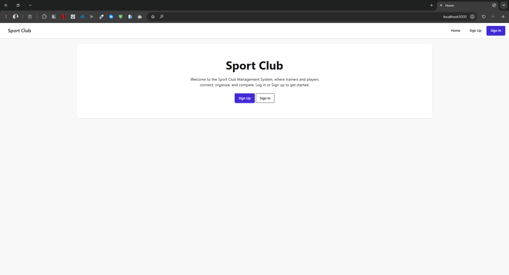
Registration
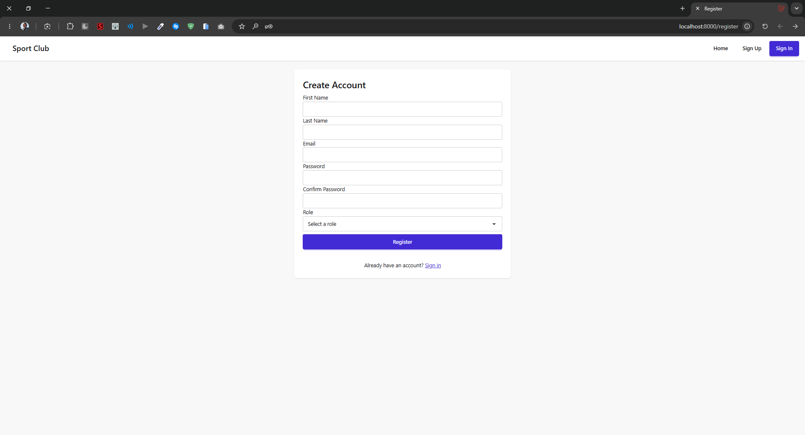
Login
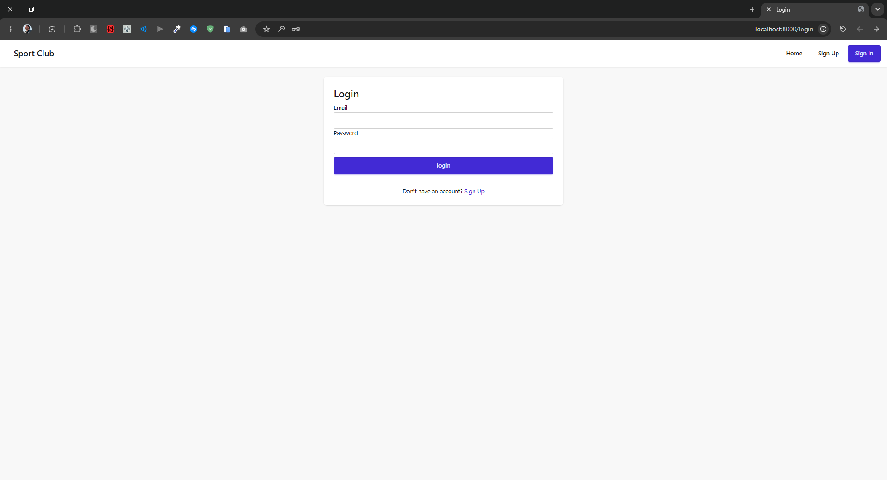
Trainer Dashboard
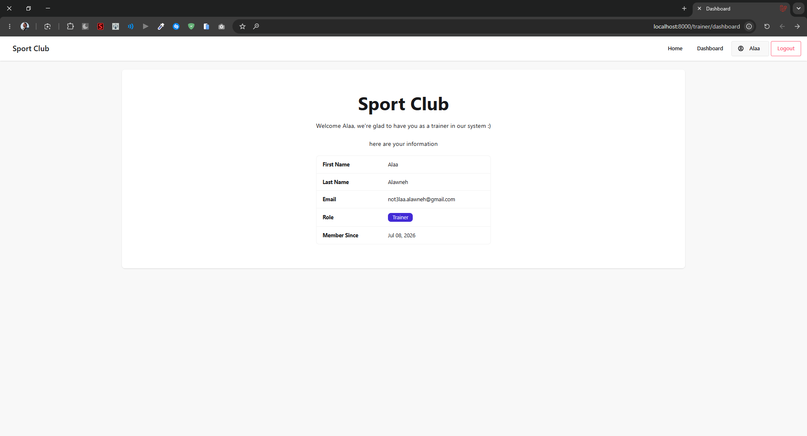
Player Dashboard

## stage 3
Player Management
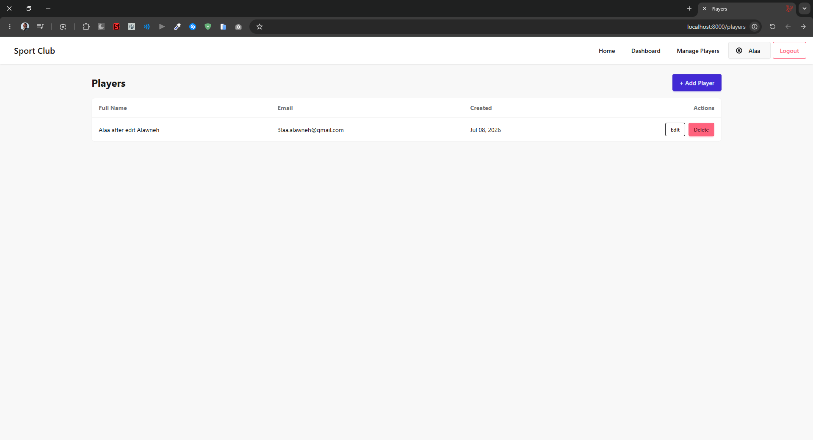
Player Adding
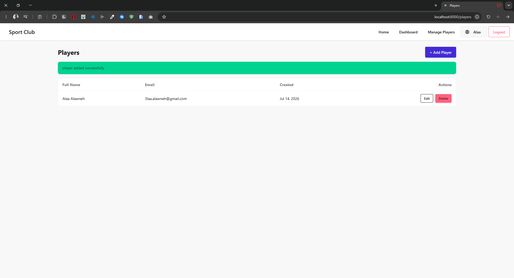
Player Editing
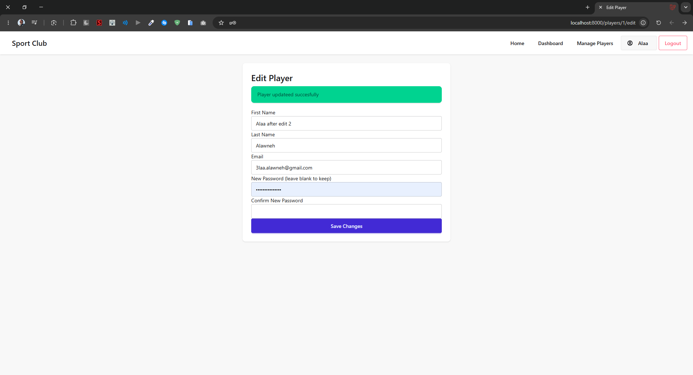
Trainer-trainer Editing(not allowed)
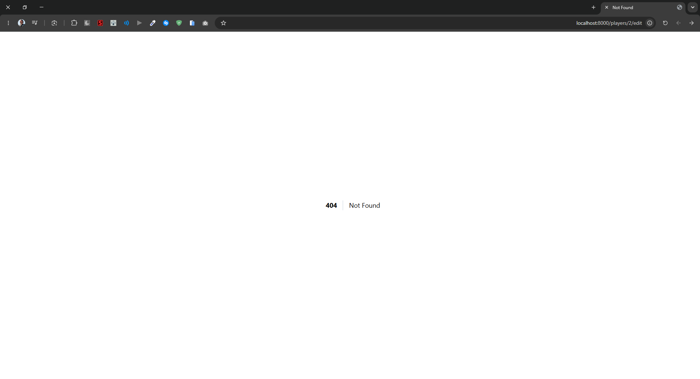
Player Delete
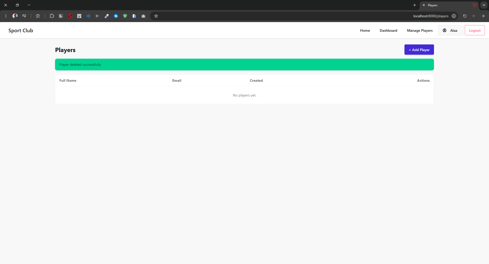
## stage 4
Match List
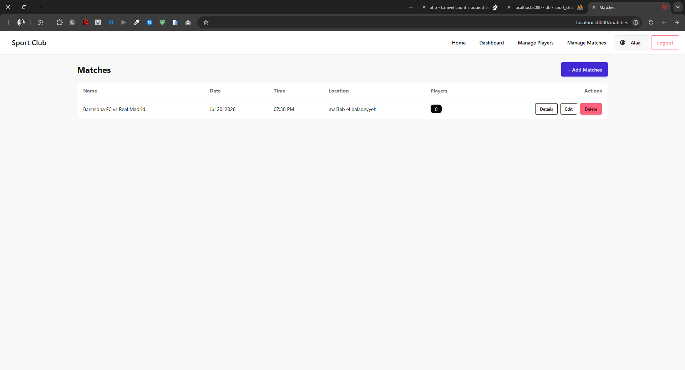
Match Create/Edit
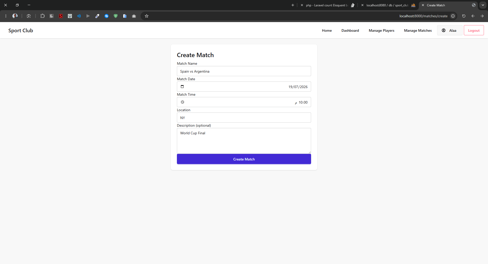
Match Details
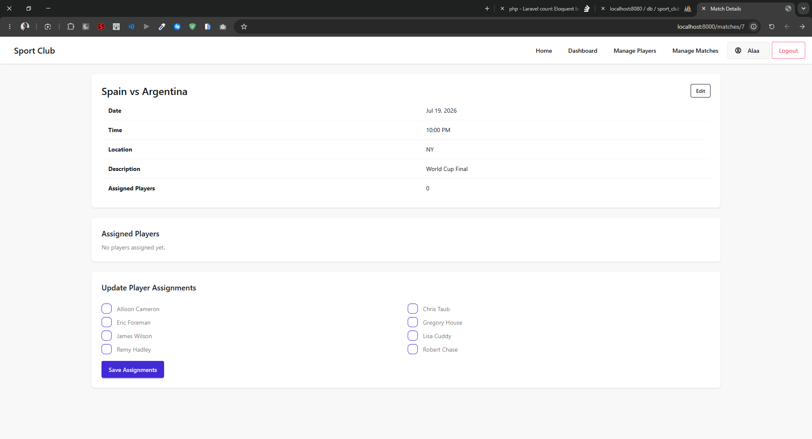
Player Assignment
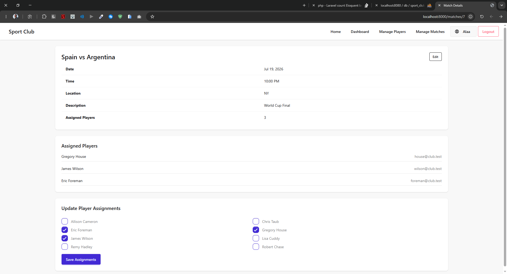